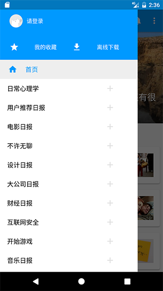
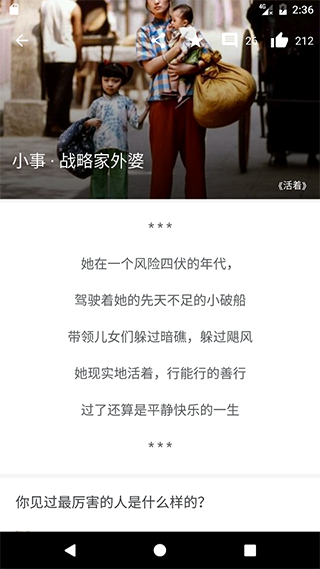
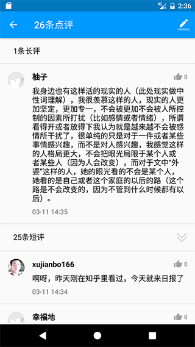
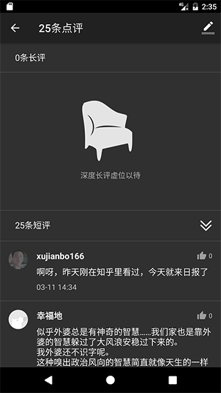
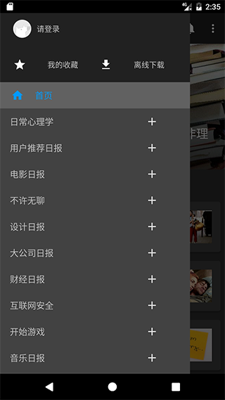

# 知乎日报

## 项目说明
该项目是一个高仿的知乎日报客户端，架构采用 `MVP` 的设计模式，图片素材均来自APP知乎日报，网络请求使用 `RxJava` + `Retrofit` 组合。

## API说明
项目所用 API 均由  **知乎**（Zhihu.Inc） 提供，由本人采取非正常手段获取。获取与共享之行为或有侵犯知乎权益的嫌疑。若被告知需停止共享与使用，本人会及时删除整个项目。
>[知乎日报-API-分析](https://github.com/izzyleung/ZhihuDailyPurify/wiki/%E7%9F%A5%E4%B9%8E%E6%97%A5%E6%8A%A5-API-%E5%88%86%E6%9E%90)

## 项目使用第三方库
>- [Retrofit](https://github.com/square/retrofit)
>- [Rxjava](https://github.com/ReactiveX/RxJava)
>- [RxAndroid](https://github.com/ReactiveX/RxAndroid)
>- [baseAdapter](https://github.com/hongyangAndroid/baseAdapter)
>- [Glide](https://github.com/bumptech/glide)

## 项目截图
### 启动界面
 
### 日间模式

### 夜间模式
 

## License
```
   Copyright 2017 Lovemma

   Licensed under the Apache License, Version 2.0 (the "License");
   you may not use this file except in compliance with the License.
   You may obtain a copy of the License at

       http://www.apache.org/licenses/LICENSE-2.0

   Unless required by applicable law or agreed to in writing, software
   distributed under the License is distributed on an "AS IS" BASIS,
   WITHOUT WARRANTIES OR CONDITIONS OF ANY KIND, either express or implied.
   See the License for the specific language governing permissions and
   limitations under the License.
```
